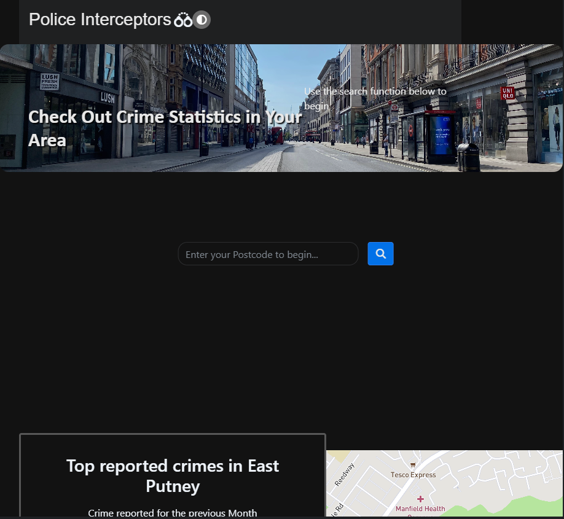

# Police-Interceptors

## Description 

This group project has been created with the goal of finding crime rates and types for a searched location. We aim to enable the user to search for a location and allow them to see current crime rates. We used data from the UK Police Data API and the OpenWeather Geocoding API to help with discerning the latitude and longitude, as well as the Mapbox API.

## Front End 

- HTML
- CSS
- JavaScript
- BootstrapCSS
- jQuery

## Contribtutions

- Alan Chumbley - Front End Developer / Repository Owner (https://github.com/Alan-Chumbley)
- Rachael Potter - Front End Developer (https://github.com/Rachp32)
- Gareth Davies - Front End Developer / UI Designer - Wireframe (https://github.com/gdavies2736)
- Ian Scott - Front End Developer (https://github.com/Jaycossey)

## Usage

Deployed Site: https://alan-chumbley.github.io/Police-Interceptors/

## Support

Contact the dev team via: https://github.com/Alan-Chumbley